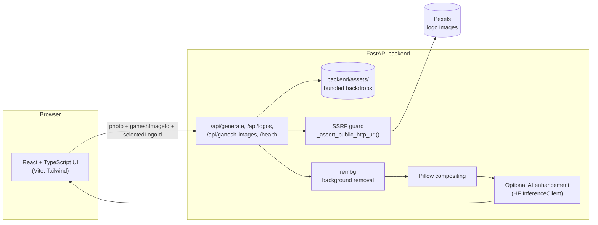

# 🐘 Ganpati — Festive AI Greetings Portal

**Turn a selfie into a personalized Ganesh Chaturthi greeting card in seconds.**

Pick a Ganesh idol backdrop, upload your photo, choose your organization's logo, and Ganpati composites everything into a shareable festive greeting — with an optional AI-enhanced, photorealistic finish.

[](https://github.com/bharat3645/Ganpati/actions/workflows/ci.yml)
[](LICENSE)
[](https://react.dev/)
[](https://www.typescriptlang.org/)
[](https://fastapi.tiangolo.com/)
[](docker-compose.yml)

---

## Overview

Ganpati is a full-stack image-compositing app built for Ganesh Chaturthi. A visitor walks through a short wizard — pick a backdrop, upload a photo, pick a logo — and the backend does the heavy lifting: it removes the background from the uploaded photo with `rembg`, layers the person and logo onto the chosen Ganesh backdrop, and (optionally, if a Hugging Face token is configured) runs the composite through an image-to-image AI model for a more photorealistic result.

Beyond the core feature, this repo is set up the way a production service should be: strict input validation with an SSRF guard on the one remaining external fetch, a hermetic automated test suite, multi-stage Docker images for both services, a `docker-compose.yml` that brings the whole stack up in one command, and a GitHub Actions pipeline that runs lint/typecheck/build/tests/Docker builds on every push.

## How It Works

1. **Choose a backdrop** — pick from six bundled Ganesh idol photos.
2. **Upload your photo** — drag-and-drop or browse; the image stays client-side until you hit generate.
3. **Pick a logo** — select from a small set of sample organization logos served by the backend.
4. **Generate** — the backend removes the background from your photo, composites you and the logo onto the chosen backdrop, then (optionally) runs the composite through an AI image-to-image model for a more photorealistic, festive result.
5. **Download & share** — get back a finished PNG/JPG greeting.

## Features

- **Three-step guided wizard** with a polished, animated React UI (Tailwind CSS).
- **AI-enhanced compositing** via Hugging Face's `InferenceClient` (FLUX.1-Kontext-dev through the `fal-ai` provider) — gracefully falls back to the base composite if no token is configured.
- **Automatic background removal** for uploaded photos using `rembg`, with a safe fallback to the original photo if removal fails.
- **Hardened, SSRF-safe API surface** (`backend/app.py`):
  - Ganesh backdrops are selected by a fixed `ganeshImageId` and loaded straight from the backend's own bundled `backend/assets/` directory — the server never fetches caller-supplied image URLs for backdrops.
  - The one legitimate remaining external fetch (organization logos from Pexels) goes through `_assert_public_http_url()`, a real SSRF guard: scheme allowlisting, DNS resolution, and `ipaddress`-level checks that block loopback, private, link-local, reserved, and multicast targets (including cloud metadata endpoints like `169.254.169.254`).
  - Real size limits — a 10 MB cap on uploaded photos and a 15 MB streamed cap on remote logo fetches — plus format/corruption validation via Pillow, so a malformed or oversized upload is rejected cleanly instead of hanging or 500-ing.
  - Clean error semantics: malformed/blank input → `422`, invalid-but-well-formed input (unknown id, corrupt image, blocked URL) → `400` with a clear message.
- **Automated backend test suite** — 26 pytest tests (`backend/tests/`) covering every endpoint, the full request-validation matrix, the happy-path generate flow, and unit tests for the SSRF guard. Fully hermetic: the logo fetch and `rembg` are monkeypatched so the suite runs in a couple of seconds, fully offline, with no `HF_TOKEN` or model download required.
- **One-command Docker stack** — multi-stage images for both the FastAPI backend and the nginx-served frontend, wired together with `docker-compose.yml`, complete with a healthcheck and a named volume so the `rembg` model is only downloaded once.
- **Continuous integration** (`.github/workflows/ci.yml`) — every push/PR runs frontend lint + typecheck + build, backend install + `pytest`, and an end-to-end Docker build of both images.

## Tech Stack

**Frontend**
- React 18 + TypeScript
- Vite
- Tailwind CSS
- Lucide React (icons)
- React Hot Toast (notifications)
- Axios

**Backend**
- FastAPI (Python)
- Pillow for image processing
- `rembg` for background removal
- Hugging Face Hub `InferenceClient` for AI image-to-image (FLUX.1-Kontext-dev via `fal-ai`)
- Pydantic for request validation
- python-dotenv for local environment configuration
- pytest + httpx for testing

**Infrastructure**
- Docker (multi-stage builds for both services) + Docker Compose
- nginx (serves the built frontend, proxies SPA routes)
- GitHub Actions (CI)

## Architecture



## Project Structure

```
Ganpati/
├── src/                        # React frontend
│   ├── App.tsx                  # Main UI: 3-step wizard + result screen
│   ├── services/api.ts          # Axios client for the backend API
│   └── main.tsx
├── public/assets/              # Bundled Ganesh idol photos + placeholder logo (frontend display)
├── backend/
│   ├── app.py                   # FastAPI app: /api/logos, /api/ganesh-images, /api/generate, /health
│   ├── run.py                   # Convenience script: installs deps + runs uvicorn
│   ├── assets/                  # Backend's own copy of the Ganesh backdrops (loaded from disk, never fetched over HTTP)
│   ├── tests/                   # pytest suite (test_app.py, conftest.py)
│   ├── requirements.txt
│   ├── requirements-dev.txt     # + pytest/httpx for running the test suite
│   ├── pytest.ini
│   ├── Dockerfile
│   └── .env.example
├── .github/workflows/ci.yml    # GitHub Actions: frontend build/lint/typecheck, backend tests, Docker build
├── Dockerfile                   # Frontend: multi-stage build served by nginx
├── nginx.conf
├── docker-compose.yml           # Runs frontend + backend together
├── index.html
├── LICENSE
└── .env.example                 # Frontend env template (VITE_API_URL)
```

## Getting Started

### Prerequisites
- Node.js 18+
- Python 3.10+
- (Optional) a Hugging Face API token with Inference API access, for AI-enhanced output

### Clone the repository
```bash
git clone https://github.com/bharat3645/Ganpati.git
cd Ganpati
```

### Frontend Setup
```bash
# Install dependencies
npm install

# Optional: point the frontend at a non-default backend URL
cp .env.example .env

# Start development server (http://localhost:5173)
npm run dev
```

### Backend Setup
```bash
cd backend

# Create and activate a virtual environment (recommended)
python -m venv .venv
.venv\Scripts\activate      # Windows
# source .venv/bin/activate  # macOS/Linux

# Install Python dependencies
pip install -r requirements.txt

# Configure environment
cp .env.example .env
# then edit .env and set HF_TOKEN if you want AI-enhanced output

# Run the server (http://localhost:8000)
python run.py
```

Without `HF_TOKEN` set, `/api/generate` still works end-to-end — it just returns the base composite image (photo + logo layered onto the chosen backdrop) instead of the AI-enhanced version, logging a warning that AI enhancement was skipped.

### Docker (run both services with one command)
Requires Docker + Docker Compose.

```bash
# Optional: enable AI enhancement
echo "HF_TOKEN=hf_your_token_here" > .env

docker compose up --build
```
- Frontend → http://localhost:5173
- Backend → http://localhost:8000

The `rembg` background-removal model is cached in a named volume (`rembg-model-cache`) so it's only downloaded once across container restarts. Override `VITE_API_URL` / `CORS_ORIGINS` via the root `.env` file if you're not using the default ports.

## Usage

1. Start both services (either the manual dev setup above, or `docker compose up --build`).
2. Open the frontend (default `http://localhost:5173`).
3. Step through the wizard: pick a Ganesh backdrop → upload your photo → pick a logo.
4. Click **Generate** and wait for the composite (and, if configured, the AI enhancement pass) to finish.
5. Download the resulting greeting image and share it.

## Testing

```bash
cd backend
pip install -r requirements.txt -r requirements-dev.txt
pytest -v
```

The suite (26 tests) covers request validation (missing/blank/oversized fields, unknown ids, malformed image data → correct `400`/`422` responses), the happy-path `/api/generate` flow, and the SSRF guard (blocks loopback/private/link-local/cloud-metadata IPs, allows public addresses). It's hermetic — the logo fetch and `rembg` background removal are stubbed so tests run offline in a couple of seconds without needing `HF_TOKEN` or a model download.

## Continuous Integration

`.github/workflows/ci.yml` runs on every push/PR to `main`:
- **Frontend** — `npm ci`, lint, `tsc -b --noEmit`, `npm run build`
- **Backend** — install, import sanity check, `pytest`
- **Docker** — builds both the backend and frontend images end-to-end

## Environment Variables

**Frontend (`.env`, see `.env.example`)**

| Variable | Description | Default |
|---|---|---|
| `VITE_API_URL` | Base URL of the backend API | `http://localhost:8000` |

**Backend (`backend/.env`, see `backend/.env.example`)**

| Variable | Description | Default |
|---|---|---|
| `HF_TOKEN` | Hugging Face API token for AI image-to-image enhancement | unset (AI enhancement skipped) |
| `CORS_ORIGINS` | Comma-separated list of allowed frontend origins | `http://localhost:5173,http://127.0.0.1:5173` |

## API Reference

### `GET /api/logos`
Returns available sample organization logos for selection.

```json
[
  { "id": "logo_01", "name": "Aperture Labs", "imageUrl": "https://example.com/logo.png" }
]
```

### `GET /api/ganesh-images`
Returns the valid `ganeshImageId` values accepted by `POST /api/generate` (the backdrop images themselves are bundled locally, not served through this endpoint).

```json
[
  { "id": "ganesh_1", "name": "Silver Floral Ganesh" }
]
```

### `POST /api/generate`
Generates the festive greeting image.

**Request:**
```json
{
  "ganeshImageId": "ganesh_1",
  "userPhotoBase64": "data:image/jpeg;base64,/9j/4AAQSkZJRg...",
  "selectedLogoId": "logo_01"
}
```

- `ganeshImageId` selects one of the backdrops in `GANESH_IMAGES_DB` (`backend/app.py`); the backend loads it from its own bundled `backend/assets/` directory on disk and never fetches a caller-supplied URL for it.
- `userPhotoBase64` is capped at 10 MB decoded and must be a recognizable JPEG/PNG/WEBP/BMP/GIF image, or the request is rejected with `400`.
- `selectedLogoId` must match an id from `GET /api/logos`.
- Malformed/oversized `userPhotoBase64` → `422` (fails pydantic validation) or `400` (fails decoding); an unknown `ganeshImageId`/`selectedLogoId` → `400`.

**Response:**
```json
{
  "success": true,
  "imageUrl": "data:image/png;base64,iVBORw0KGgoAAAANSUhEUg..."
}
```

### `GET /health`
Simple health check used by the frontend, Docker Compose's healthcheck, and manual verification, to confirm the backend is reachable.

## Image Processing Pipeline

1. **Asset preparation** — load the selected Ganesh backdrop from local disk, decode and validate the user's photo, fetch the selected logo image (through the SSRF guard).
2. **Background removal** — `rembg` isolates the person from their uploaded photo.
3. **Composite creation** — the person and logo are layered onto the Ganesh backdrop.
4. **AI enhancement** *(optional, requires `HF_TOKEN`)* — the composite is transformed into a more photorealistic image via FLUX.1-Kontext-dev.
5. **Result delivery** — the final image is returned as a base64 data URL.

**Key parameters:** AI strength `0.75`, inference steps `50`, PNG internally for transparency support (downloaded as JPG).

## Security

- No hardcoded credentials ship in this repo. `HF_TOKEN` must be supplied via `backend/.env` or the environment — the app runs fine without it, just without AI enhancement.
- `/api/generate` validates every input: uploaded photos are capped at 10 MB and must decode to a real JPEG/PNG/WEBP/BMP/GIF image; Ganesh backdrops are loaded from a fixed local set (`ganeshImageId`), never fetched from a caller-supplied URL; remote logo fetches are capped at 15 MB and pass through the SSRF guard (`backend/app.py::_assert_public_http_url`), which blocks loopback/private/link-local/reserved addresses (including cloud metadata endpoints).
- Still missing before any public deployment: rate limiting and authentication on `/api/generate` — today it is an unauthenticated, uncapped-per-IP endpoint.

Found a security issue? Please open an issue on the [GitHub repo](https://github.com/bharat3645/Ganpati/issues) rather than a public PR.

## Known Limitations / Production Considerations

**Frontend**
- Logo images are placeholder stock photos, not real logo assets — swap in real ones for production use.
- No error boundaries yet; a rendering error anywhere in the tree will blank the page.
- Uploaded photos aren't compressed client-side before being base64-encoded, so very large photos increase request size and generation time.

**Backend**
- The logo database (`LOGOS_DB`) is an in-memory Python list, not persisted storage — restarting the server resets it to the built-in defaults.
- Generated images are returned inline as base64 rather than uploaded to a CDN/object store; fine for a demo, not for scale.
- `allow_origins` is configurable via `CORS_ORIGINS` but defaults to local dev origins only — update it for any deployed frontend origin.

## Customization

**Adding new backdrops** — backdrops are duplicated in two places by design: `public/assets/` for the frontend to *display*, `backend/assets/` for the backend to *composite with* (loaded from local disk, never fetched over HTTP).
1. Drop the new image in both `public/assets/` and `backend/assets/`.
2. Add a matching entry to the `ganeshImages` array in `src/App.tsx`.
3. Add a matching entry (same `id`, filename) to `GANESH_IMAGES_DB` in `backend/app.py`.

**Adding new logos** — update the `LOGOS_DB` list in `backend/app.py`.

**Modifying the AI prompt** — edit `prompt_text` in the `generate_ai_image` function (`backend/app.py`).

**UI theming** — modify Tailwind classes in `src/App.tsx` to change colors, layout, and animations.

## Troubleshooting

1. **"Backend server is not running"** — start the backend (`python backend/run.py`) and confirm it's reachable at the URL in `VITE_API_URL`.
2. **Background removal looks off** — falls back to the original (un-removed-background) photo automatically if `rembg` fails.
3. **AI generation is skipped** — check that `HF_TOKEN` is set in `backend/.env`; without it, AI enhancement is intentionally skipped in favor of the base composite.
4. **CORS errors in the browser console** — make sure `CORS_ORIGINS` in `backend/.env` includes the exact origin the frontend is served from.
5. **Debug logging** — the backend logs at `INFO` level by default; change `logging.basicConfig(level=...)` in `backend/app.py` for more/less verbosity.
6. **`400` from `/api/generate`** — the response `detail` explains why (unknown `ganeshImageId`/`selectedLogoId`, oversized/corrupt photo, or the SSRF guard rejecting a logo URL); see the API Reference section above.
7. **Docker: frontend can't reach the backend** — the frontend's `VITE_API_URL` is baked in at *build* time (Vite inlines env vars into the bundle). If you change it, rebuild the frontend image (`docker compose build frontend`) rather than just restarting the container.

## Contributing

Issues and pull requests are welcome — please open an issue at [github.com/bharat3645/Ganpati/issues](https://github.com/bharat3645/Ganpati/issues) to discuss significant changes before submitting a PR.

## License

This project is licensed under the [MIT License](LICENSE) © Bharat Singh Parihar.
